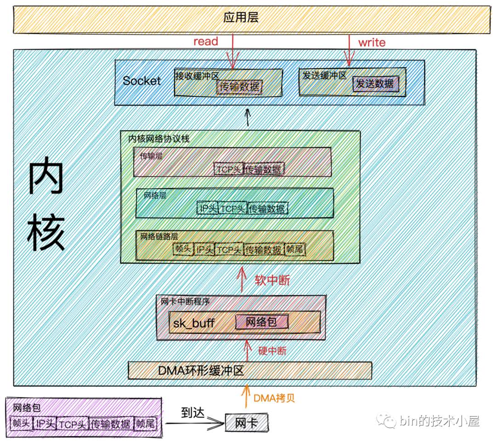
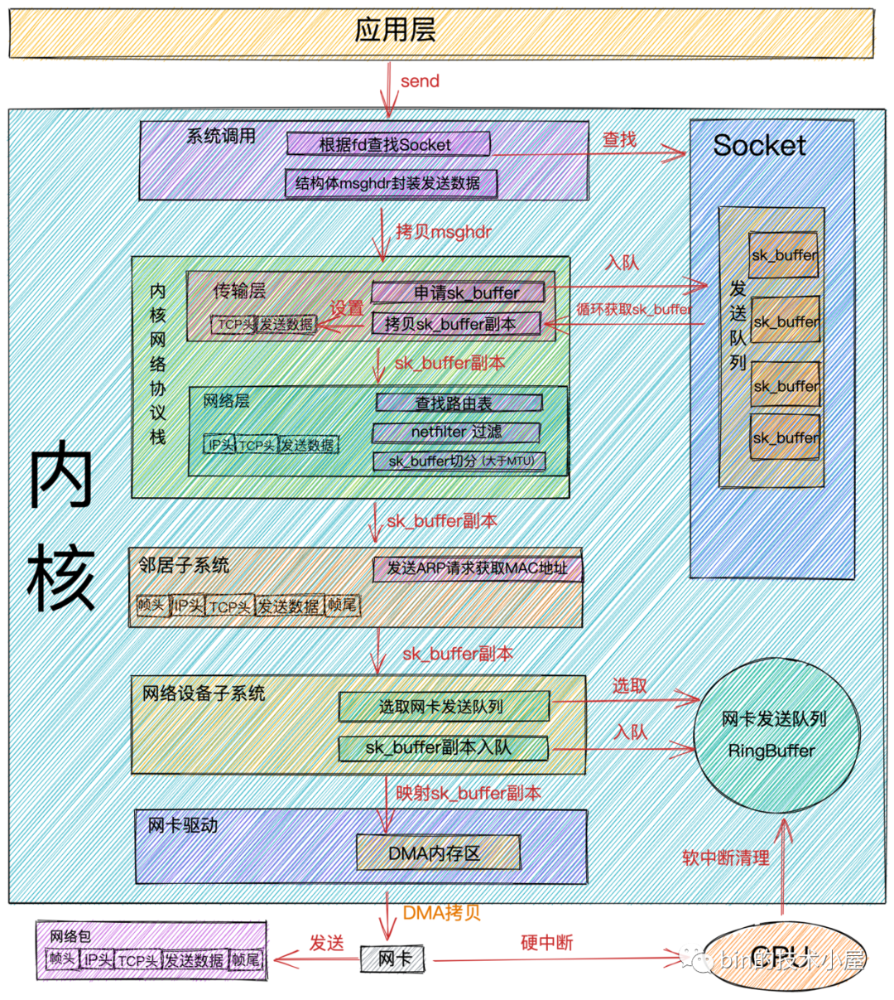

# ✒️ Java

概述

其实Java也是作为一个进程在系统中跑，它是通过自己内部的管理机制(JVM)来进一步管理的。

* 能不进行系统调用，就不进行，减少内核态的转换，自己完善管理也能细化操作，减少内存泄漏

## JVM

## Netty与IO模型

<figure><figcaption>
网络包接受过程
</figcaption></figure> <figure><figcaption>
网络包发送过程
</figcaption></figure>

### 这些数据传输，为啥要有这么多过程？

### 阻塞IO

